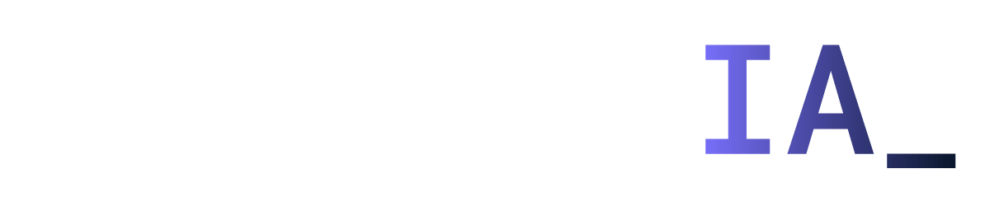
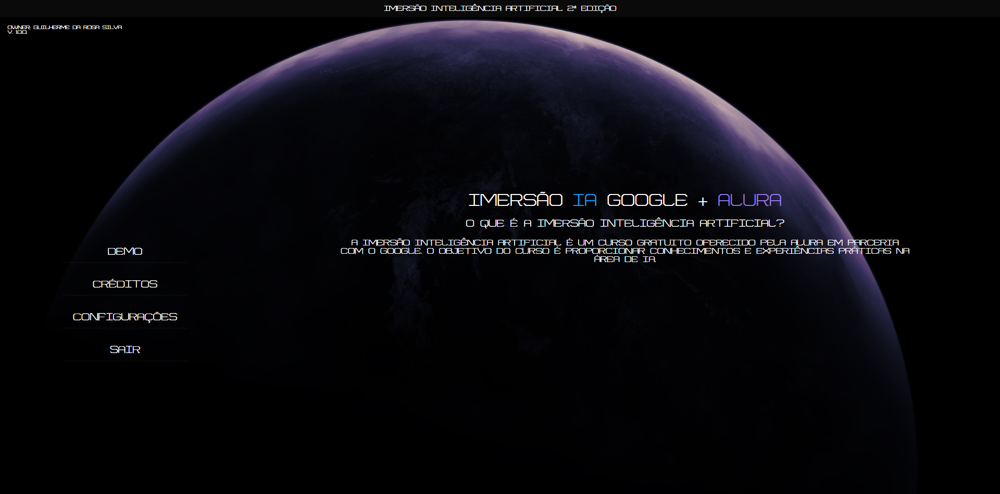

  

 
 

  
### Website construido para a apresentação do meu aprendizado na semana da Imersão IA Alura + Google, onde tive 5 aulas muito mais que práticas e testadoras para imergir no mundo da Inteligência Artificial.

##### O website inteiro foi realizado sem o uso de frameworks ou bibliotecas.

 

## Pre-visualização

  

